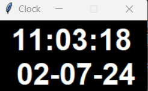

# digital-clock

Digital Clock written in Python

## License

Please see [Apache 2.0 License](./LICENSE) for details.

## Image

## Works Cited

Sanchhaya Education Private Limited. “Python | Create a Digital Clock Using Tkinter.” *Geeks for Geeks’ Website*,
Sanchhaya Education Private Limited, 25 Oct.
2022, <www.geeksforgeeks.org/python-create-a-digital-clock-using-tkinter/?ref=lbp>. Accessed 7 Feb. 2024.
